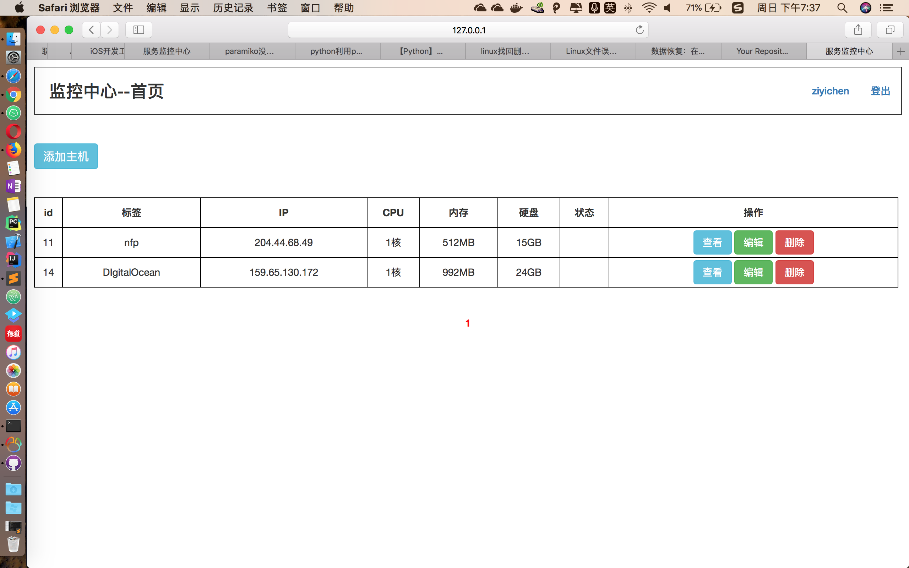
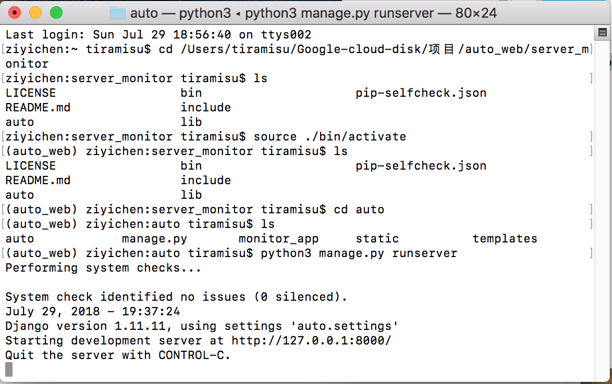
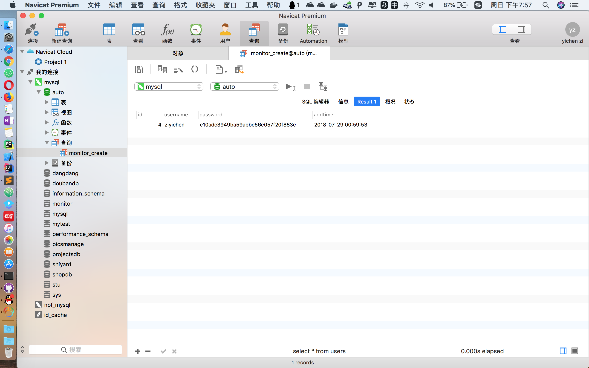

# server_monitor

服务器监控程序 

可登陆管理自己的多台服务器，实现实时监控.
后端使用Django框架

### 运行首页如图：

### 使用方法：

### 运行环境：
Python3

### 安全性：
采用hash算法加密用户密码，数据库user数据表案例如图：

#### 注意：
添加管理的服务器必须要支持Python3可以正常添加进行管理

详细实现过程过一段时间可以看我博客：https://www.runtofuture.cn 

今天实验时不小心删除了Nginx环境，导致今晚无法将实现过程写在博客上了，有时间我会补上。

